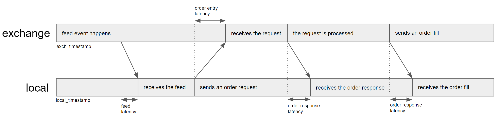
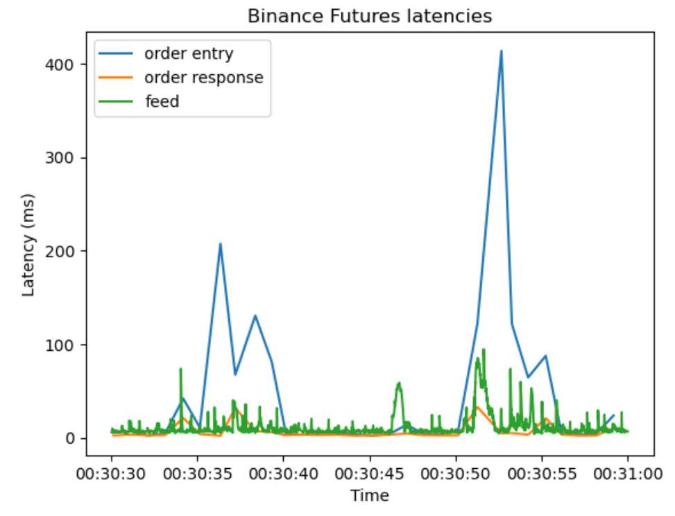

========
延迟模型
========

概览
----

回测高频交易策略时，延迟是必须考虑的重要因素。HftBacktest 中有三类延迟。

* 行情延迟

行情延迟是指交易所发出订单簿变化、成交等行情事件，到本地接收到这些事件之间的延迟。HftBacktest 通过两个时间戳处理它：本地时间戳和交易所时间戳。

* 订单进入延迟

订单进入延迟是指你发送订单请求，到该请求被交易所撮合引擎处理之间的延迟。

* 订单回报延迟

订单回报延迟是指交易所撮合引擎处理订单请求后，到本地收到订单回报之间的延迟。订单成交回报也会受到这类延迟影响。

订单延迟模型
------------

HftBacktest 提供以下订单延迟模型，也支持实现自定义延迟模型。

ConstantLatency
~~~~~~~~~~~~~~~

最基础的模型，使用固定延迟。只需要直接设置延迟值。

更多细节见：

* `ConstantLatency <https://docs.rs/hftbacktest/latest/hftbacktest/backtest/models/struct.ConstantLatency.html>`_
  和 :meth:`constant_latency <hftbacktest.BacktestAsset.constant_latency>`

IntpOrderLatency
~~~~~~~~~~~~~~~~

该模型根据真实订单延迟数据插值得到订单延迟。如果有细粒度时间间隔的延迟数据，这是内置模型中最准确的一种。可以通过定期提交不会成交的订单来采集延迟数据。

更多细节见：

* `IntpOrderLatency <https://docs.rs/hftbacktest/latest/hftbacktest/backtest/models/struct.IntpOrderLatency.html>`_
  和 :meth:`intp_order_latency <hftbacktest.BacktestAsset.intp_order_latency>`

**数据示例**

.. code-block::

    req_ts (request timestamp at local), exch_ts (exchange timestamp), resp_ts (receipt timestamp at local), _padding
    1670026844751525000, 1670026844759000000, 1670026844762122000, 0
    1670026845754020000, 1670026845762000000, 1670026845770003000, 0

FeedLatency
~~~~~~~~~~~

如果没有实盘订单延迟数据，可以使用行情延迟生成人工订单延迟。请参考官方教程 `Order Latency Data <https://hftbacktest.readthedocs.io/en/latest/tutorials/Order%20Latency%20Data.html>`_。

实现自定义订单延迟模型
~~~~~~~~~~~~~~~~~~~~~~

需要实现下面的 trait：

* `LatencyModel <https://docs.rs/hftbacktest/latest/hftbacktest/backtest/models/trait.LatencyModel.html>`_

请参考 `latency model implementation <https://github.com/nkaz001/hftbacktest/blob/master/hftbacktest/src/backtest/models/latency.rs>`_。
