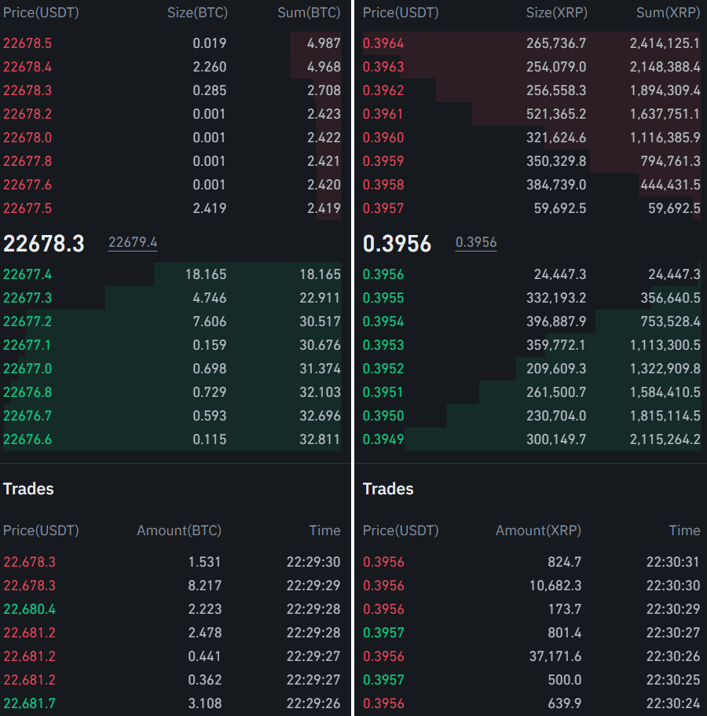
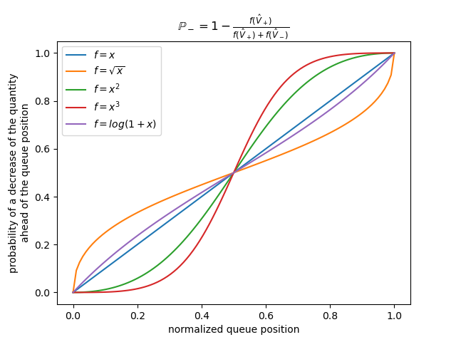
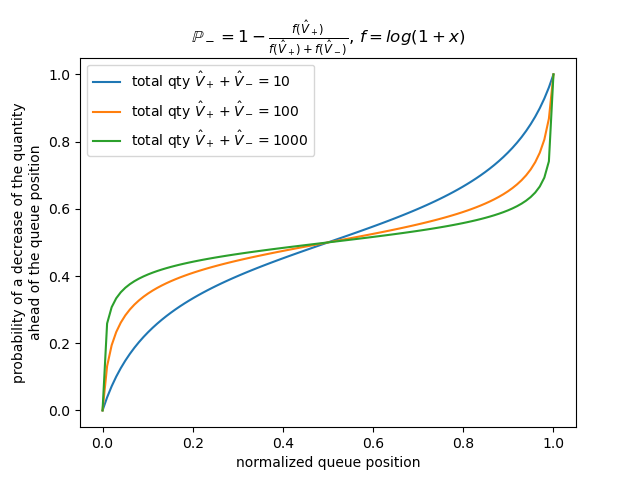
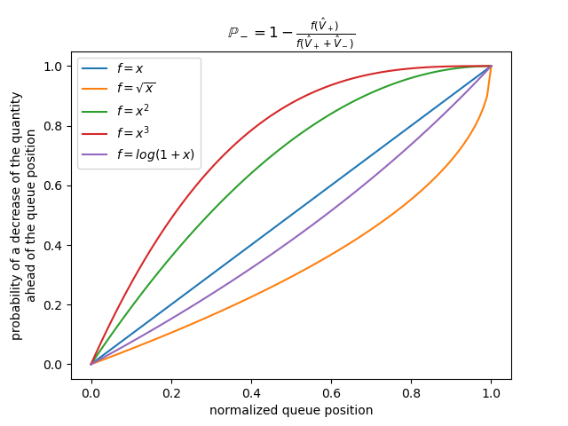
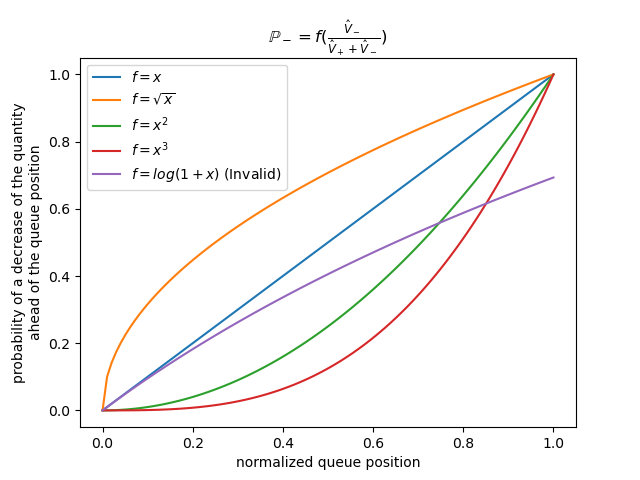

========
订单成交
========

交易所模型
==========

HftBacktest 是基于市场数据回放的回测工具。这意味着你的订单不会改变仿真市场，也不会产生市场冲击。因此，一个重要前提是：你的订单规模足够小，不会显著影响市场。最终仍需要在真实市场中验证策略，并根据回测结果和实盘结果的差异修正回测假设。

HftBacktest 提供两类交易所仿真。:ref:`order_fill_no_partial_fill_exchange` 是默认模型，不会产生部分成交。:ref:`order_fill_partial_fill_exchange` 是扩展模型，会在特定情况下考虑部分成交。由于市场数据回放无法改变市场，某些部分成交场景仍可能不现实，例如主动吃掉市场流动性。原因是即使你的订单吃掉了流动性，回放数据中的市场深度和成交记录也不会随之改变。因此，必须理解每种回测仿真的底层假设。

.. _order_fill_no_partial_fill_exchange:

NoPartialFillExchange
---------------------

无部分成交模型的完全成交条件
~~~~~~~~~~~~~~~~~~~~~~~~~~~~

订单簿中的买单：

* 订单价格 >= 最优卖价。
* 订单价格 > 卖方成交价。
* 订单位于队列最前 && 订单价格 == 卖方成交价。

订单簿中的卖单：

* 订单价格 <= 最优买价。
* 订单价格 < 买方成交价。
* 订单位于队列最前 && 订单价格 == 买方成交价。

无部分成交模型中的主动吃单
~~~~~~~~~~~~~~~~~~~~~~~~~~

    无论最优档位的数量是多少，主动吃单都会在最优价完全成交。如果尝试执行大数量订单，这可能导致不现实的成交模拟。

更多细节见：

* `NoPartialFillExchange <https://docs.rs/hftbacktest/latest/hftbacktest/backtest/proc/struct.NoPartialFillExchange.html>`_
  和 :meth:`no_partial_fill_exchange <hftbacktest.BacktestAsset.no_partial_fill_exchange>`

.. _order_fill_partial_fill_exchange:

PartialFillExchange
-------------------

部分成交模型的完全成交条件
~~~~~~~~~~~~~~~~~~~~~~~~~~

订单簿中的买单：

* 订单价格 >= 最优卖价。
* 订单价格 > 卖方成交价。

订单簿中的卖单：

* 订单价格 <= 最优买价。
* 订单价格 < 买方成交价。

部分成交条件
~~~~~~~~~~~~

订单簿中的买单：

* 由剩余卖方成交数量成交：订单位于队列最前 && 订单价格 == 卖方成交价。

订单簿中的卖单：

* 由剩余买方成交数量成交：订单位于队列最前 && 订单价格 == 买方成交价。

部分成交模型中的主动吃单
~~~~~~~~~~~~~~~~~~~~~~~~

    主动吃单会按订单簿数量成交，即使最优价和数量不会因为你的成交而变化。如果尝试执行大数量订单，这可能导致不现实的成交模拟。

更多细节见：

* `PartialFillExchange <https://docs.rs/hftbacktest/latest/hftbacktest/backtest/proc/struct.PartialFillExchange.html>`_
  和 :meth:`partial_fill_exchange <hftbacktest.BacktestAsset.partial_fill_exchange>`

队列模型
========

在回测中，订单成交模拟是否准确，取决于订单簿流动性、交易活跃度，以及你对订单队列位置的估计。如果交易所不提供 Market-By-Order 数据，就需要用模型估计队列位置。HftBacktest 目前主要支持加密货币交易所常见的 Market-By-Price 数据，并提供以下队列位置模型用于成交模拟。

更多细节见 `Models <https://docs.rs/hftbacktest/latest/hftbacktest/backtest/models/index.html>`_。

RiskAverseQueueModel
--------------------

从队列中的成交概率看，这是最保守的模型。订单簿中因撤单或改单导致的数量减少只发生在队尾，因此你的订单队列位置不会变化。只有当该价格发生成交时，订单队列位置才会前移。

更多细节见：

* `RiskAdverseQueueModel <https://docs.rs/hftbacktest/latest/hftbacktest/backtest/models/struct.RiskAdverseQueueModel.html>`_
  和 :meth:`risk_adverse_queue_model <hftbacktest.BacktestAsset.risk_adverse_queue_model>`

.. _order_fill_prob_queue_model:

ProbQueueModel
--------------

该模型基于当前队列位置构造概率模型，数量减少可能发生在你的订单之前，也可能发生在你的订单之后。因此，你的队列位置也会按概率前移。

该模型参考以下资料实现：

* https://quant.stackexchange.com/questions/3782/how-do-we-estimate-position-of-our-order-in-order-book
* https://rigtorp.se/2013/06/08/estimating-order-queue-position.html

更多细节见：

* `ProbQueueModel <https://docs.rs/hftbacktest/latest/hftbacktest/backtest/models/struct.ProbQueueModel.html>`_

* `PowerProbQueueFunc <https://docs.rs/hftbacktest/latest/hftbacktest/backtest/models/struct.PowerProbQueueFunc.html>`_
  和 :meth:`power_prob_queue_model <hftbacktest.BacktestAsset.power_prob_queue_model>`

* `PowerProbQueueFunc2 <https://docs.rs/hftbacktest/latest/hftbacktest/backtest/models/struct.PowerProbQueueFunc2.html>`_
  和 :meth:`power_prob_queue_model2 <hftbacktest.BacktestAsset.power_prob_queue_model2>`

* `PowerProbQueueFunc3 <https://docs.rs/hftbacktest/latest/hftbacktest/backtest/models/struct.PowerProbQueueFunc3.html>`_
  和 :meth:`power_prob_queue_model3 <hftbacktest.BacktestAsset.power_prob_queue_model3>`

* `LogProbQueueFunc <https://docs.rs/hftbacktest/latest/hftbacktest/backtest/models/struct.LogProbQueueFunc.html>`_
  和 :meth:`log_prob_queue_model <hftbacktest.BacktestAsset.log_prob_queue_model>`

* `LogProbQueueFunc2 <https://docs.rs/hftbacktest/latest/hftbacktest/backtest/models/struct.LogProbQueueFunc2.html>`_
  和 :meth:`log_prob_queue_model2 <hftbacktest.BacktestAsset.log_prob_queue_model2>`

默认提供三种变体，它们有不同的概率曲线。

与幂函数不同，函数 ``f = log(1 + x)`` 的概率曲线会随该价格档位的总数量变化。

设置函数 ``f`` 时，应满足以下条件：

* ``f(0)`` 对应的概率应为 0。因为如果订单位于队首，所有数量减少都应发生在订单之后。
* ``f(1)`` 对应的概率应为 1。因为如果订单位于队尾，所有数量减少都应发生在订单之前。

可以在官方教程 `Probability Queue Models <https://hftbacktest.readthedocs.io/en/latest/tutorials/Probability%20Queue%20Models.html>`_ 中查看这些模型的比较。

实现自定义队列模型
------------------

需要根据使用需求，在 Rust 中实现以下 trait：

* `QueueModel <https://docs.rs/hftbacktest/latest/hftbacktest/backtest/models/trait.QueueModel.html>`_
* `L3QueueModel <https://docs.rs/hftbacktest/latest/hftbacktest/backtest/models/trait.L3QueueModel.html>`_

请参考 `queue model implementation <https://github.com/nkaz001/hftbacktest/blob/master/hftbacktest/src/backtest/models/queue.rs>`_。

参考资料
========

该功能最初参考以下文章实现：

* http://www.math.ualberta.ca/~cfrei/PIMS/Almgren5.pdf
* https://quant.stackexchange.com/questions/3782/how-do-we-estimate-position-of-our-order-in-order-book
